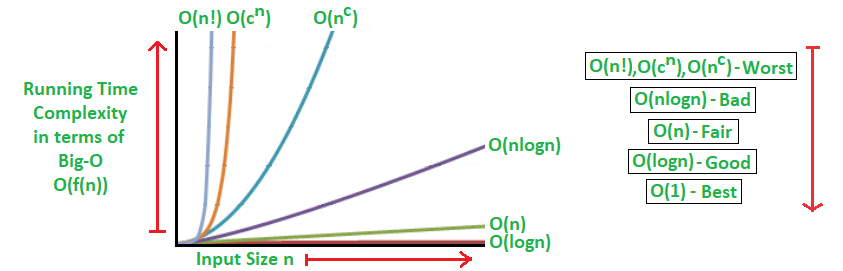

# Data Structure and Algorithms

[source](https://www.geeksforgeeks.org/learn-data-structures-and-algorithms-dsa-tutorial)

## Data Structures
A data structure is defined as a particular way of storing and organizing data in our devices to use the data efficiently 
and effectively. The main idea behind using data structures is to minimize the time and space complexities. An efficient 
data structure takes minimum memory space and requires minimum time to execute the data.

## Algorithm
Algorithm is defined as a process or set of well-defined instructions that are typically used to solve a particular group 
of problems or perform a specific type of calculation. To explain in simpler terms, it is a set of operations performed 
in a step-by-step manner to execute a task.

## How to learn DSA
1. Learn about Time and Space complexities
2. Learn the basics of individual Data Structures
3. Learn the basics of Algorithms
4. Practice Problems on DSA

## Complexities
1. Time Complexity: Time complexity is used to measure the amount of time required to execute the code.
   - The number of operations performed in the program, 
   - The speed of the device, and also 
   - The speed of data transfer if being executed on an online platform.
2. Space Complexity: Space complexity means the amount of space required to execute successfully the functionalities
   - Auxiliary Space very commonly in DSA, which refers to the extra space used in the program other than the input data
structure.

> Asymptotic notation is a mathematical tool that calculates the required time in terms of input size and does not 
> require the execution of the code.

- *Big-O Notation (Ο)* – Big-O notation specifically describes the worst-case scenario.
- *Omega Notation (Ω)* – Omega(Ω) notation specifically describes the best-case scenario.
- *Theta Notation (θ)* – This notation represents the average complexity of an algorithm.

## Data Structures

### [Array](array)
> The most basic yet important data structure is the array. It is a linear data structure. An array is a collection of 
> homogeneous data types where the elements are allocated contiguous memory. Because of the contiguous allocation of 
> memory, any element of an array can be accessed in constant time. Each array element has a corresponding index number. 
- Reverse Array – Reverse an array means shifting the elements of an array in a reverse manner i.e., the last element becomes the first element, second last element becomes the second element, and so on. 
- Rotation of Array – Rotation of array means shifting the elements of an array in a circular manner i.e., in the case of right circular shift the last element becomes the first element, and all other element moves one point to the right. 
- Rearranging an array – Rearrangement of array elements suggests the changing of an initial order of elements following some conditions or operations.
- Range queries in the array – Often you need to perform operations on a range of elements. These functions are known as range queries.
- Multidimensional array – These are arrays having more than one dimension. The most used one is the 2-dimensional array, commonly known as a matrix.
- Kadane’s algorithm
- Dutch national flag algorithm

### String
> A string is also a type of array. It can be interpreted as an array of characters. But it has some special 
> characteristics like the last character of a string is a null character to denote the end of the string. Also, there 
> are some unique operations, like concatenation which concatenates two strings into one.
- Subsequence and substring – A subsequence is a sequence that can be derived from a string deleting one or more elements. A substring is a contiguous segment of the string.
- Reverse and rotation in a string – Reverse operation is interchanging the position of characters of a string such that the first becomes the last, the second becomes the second last, and so on.
- Binary String – A binary string is a string made up of only two types of characters.
- Palindrome – A palindrome string is a string in which the elements at the same distance from the center of the string are the same.
- Lexicographic pattern – Lexicographical pattern is the pattern based on the ASCII value or can be said in dictionary order.
- Pattern searching – Pattern searching is searching a given pattern in the string. It is an advanced topic of string.

### Linked Lists
> As the above data structures, the linked list is also a linear data structure. But Linked List is different from Array
> in its configuration. It is not allocated to contiguous memory locations. Instead, each node of the linked list is 
> allocated to some random memory space and the previous node maintains a pointer that points to this node. So no direct
> memory access of any node is possible and it is also dynamic i.e., the size of the linked list can be adjusted at any 
> time.
- Singly Linked List – In this, each node of the linked list points only to its next node.
- Circular Linked List – This is the type of linked list where the last node points back to the head of the linked list.
- Doubly Linked List – In this case, each node of the linked list holds two pointers, one point to the next node and the other points to the previous node.

### Matrix/Grid
> A matrix represents a collection of numbers arranged in an order of rows and columns. It is necessary to enclose the 
> elements of a matrix in parentheses or brackets.

### Stack
> Stack is a linear data structure which follows a particular order in which the operations are performed. The order may 
> be *LIFO(Last In First Out)* or *FILO(First In Last Out)*.

### Queue
> A Queue is a linear structure which follows First In First Out (FIFO) approach in its individual operations.
- Circular queue – In a circular queue the last element is connected to the first element of the queue
- Double-ended queue (or known as deque) – A double-ended queue is a special type of queue where one can perform the operations from both ends of the queue.
- Priority queue – It is a special type of queue where the elements are arranged as per their priority. A low priority element is dequeued after a high priority element.

### Heap
> A Heap is a special Tree-based Data Structure in which the tree is a complete binary tree.
- Max-Heap: In this heap, the value of the root node must be the greatest among all its child nodes and the same thing must be done for its left and right sub-tree also.
- Min-Heap: In this heap, the value of the root node must be the smallest among all its child nodes and the same thing must be done for its left ans right sub-tree also

### Hash
> Hashing refers to the process of generating a fixed-size output from an input of variable size using the mathematical 
> formulas known as hash functions. This technique determines an index or location for the storage of an item in a data 
> structure.

### Tree
> Tree data structure is similar to a tree we see in nature but it is upside down. It also has a root and leaves. The 
> root is the first node of the tree and the leaves are the ones at the bottom-most level. The special characteristic of 
> a tree is that there is only one path to go from any of its nodes to any other node.
- Binary tree – This is a special type of tree where each node can have a maximum of 2 children.
- Ternary tree – This is a special type of tree where each node can have a maximum of 3 children.
- N-ary tree – In this type of tree, a node can have at most N children.
- Complete Binary Tree – In this type of binary tree all the levels are filled except maybe for the last level. But the last level elements are filled as left as possible.
- Perfect Binary Tree – A perfect binary tree has all the levels filled
- Binary Search Tree – A binary search tree is a special type of binary tree where the smaller node is put to the left of a node and a higher value node is put to the right of a node
- Ternary Search Tree – It is similar to a binary search tree, except for the fact that here one element can have at most 3 children.

### Graph
> Another important non-linear data structure is the graph. It is similar to the Tree data structure, with the 
> difference that there is no particular root or leaf node, and it can be traversed in any order.

## Algorithm

### Searching
> Searching algorithms are used to find a specific element in an array, string, linked list, or some other data structure.
- Linear Search – In this searching algorithm, we check for the element iteratively from one end to the other.
- Binary Search – In this type of searching algorithm, we break the data structure into two equal parts and try to decide in which half we need to find for the element. 
- Ternary Search – In this case, the array is divided into three parts, and based on the values at partitioning positions we decide the segment where we need to find the required element.
- Jump Search
- Interpolation Search 
- Exponential Search

### Sorting
> Sorting Algorithm is used to rearrange a given array or list elements according to a comparison operator on the 
> elements. The comparison operator is used to decide the new order of element in the respective data structure.
- Bubble Sort
- Selection Sort
- Insertion Sort
- Quick Sort
- Merge Sort

### Divide and Conquer
> Divide and Conquer is an algorithmic paradigm. A typical Divide and Conquer algorithm solves a problem using following three steps. 
> - Divide: Break the given problem into subproblems of same type. 
> - Conquer: Recursively solve these subproblems 
> - Combine: Appropriately combine the answers

### Greedy
> As the name suggests, this algorithm builds up the solution one piece at a time and chooses the next piece which gives 
> the most obvious and immediate benefit i.e., which is the most optimal choice at that moment. So the problems where 
> choosing locally optimal also leads to the global solutions are best fit for Greedy.

### Recursion
> Recursion is one of the most important algorithms which uses the concept of code reusability and repeated usage of 
> the same piece of code.
- Tree traversals
- Graph traversals
- Divide and Conquers Algorithms
- Backtracking algorithms

### Backtracking Algorithm
> Backtracking is an algorithmic technique for solving problems recursively by trying to build a solution incrementally, 
> one piece at a time, removing those solutions that fail to satisfy the constraints of the problem at any point of time
- Knight’s tour problem
- Rat in a maze
- N-Queen problem
- Subset sum problem
- m-coloring problem
- Hamiltonian cycle
- Sudoku

### Dynamic Programming
> The main concept of the Dynamic Programming algorithm is to use the previously calculated result to avoid repeated 
> calculations of the same subtask which helps in reducing the time complexity.

### Pattern Searching
> The Pattern Searching algorithms are sometimes also referred to as String Searching Algorithms and are considered as a
> part of the String algorithms. These algorithms are useful in the case of searching a string within another string.

### Mathematical Algorithms
> These algorithms are designed to solve Mathematical and Number Theory problems. They requires in-depth knowledge of different mathematical concepts like
- GCD and LCM
- Prime Factorization and Divisors
- Fibonacci Numbers
- Catalan Numbers
- Modular Arithmetic
- Euler Totient Function
- nCr Computations
- Set Theory
- Factorial
- Prime numbers and Primality Tests
- Sieve Algorithms, etc.

### Geometric Algorithms
> These algorithms are designed to solve Geometric Problems. They requires in-depth knowledge of different mathematical 
> concepts
- Lines
- Triangle
- Rectangle
- Square
- Circle
- 3D Objects
- Quadilateral
- Polygon & Convex Hull

### Bitwise Algorithms
> The Bitwise Algorithms is used to perform operations at the bit-level or to manipulate bits in different ways. 
> The bitwise operations are found to be much faster and are sometimes used to improve the efficiency of a program.

### Randomized Algorithms
> An algorithm that uses random numbers to decide what to do next anywhere in its logic is called Randomized Algorithm.

### Branch and Bound Algorithm
> Branch and bound is an algorithm design paradigm which is generally used for solving combinatorial optimization 
> problems. These problems are typically exponential in terms of time complexity and may require exploring all possible 
> permutations in worst case. The Branch and Bound Algorithm technique solves these problems relatively quickly.
