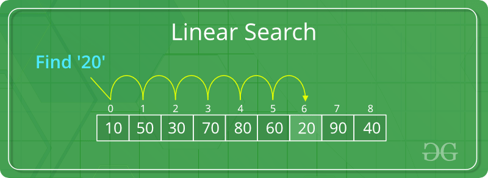
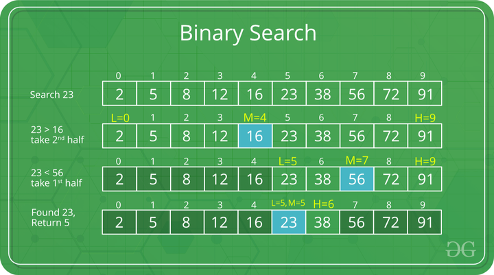

# Searching Algorithms

Searching algorithms are essential tools in computer science used to locate specific items within a collection of data. 
These algorithms are designed to efficiently navigate through data structures to find the desired information, making 
them fundamental in various applications such as databases, web search engines, and more.


## Linear Search

Linear Search is defined as a sequential search algorithm that starts at one end and goes through each element of a list 
until the desired element is found, otherwise the search continues till the end of the data set.



### requirements:
- unsorted array of any data types
- target element

### Example

```python
# Python3 code to linearly search x in arr[].

def search(arr, N, x):

    for i in range(0, N):
        if (arr[i] == x):
            return i
    return None


arr = [2, 3, 4, 10, 40]
x = 10
N = len(arr)

# Function call
result = search(arr, N, x)

if result:
    print("Element is not present in array")
else:
    print("Element is present at index", result)
```

### Time Complexity:
- Best Case:     O(1)  _first element_
- Worst Case:    O(N)
- Average Case:  O(N)

### Auxiliary space:
- O(1)

### Advantages:
- any data type
- no matter is array sorted or not
- no additional memory
- well-suited for small datasets

### Drawbacks:
- not for large datasets

## Sentinel Linear Search

same as **Linear search** but target value at the end, it helps to process a hege datasets by not storing it in memory

The sentinel linear search algorithm is useful for arrays with a large number of elements where the target value may be 
located towards the end of the array. By adding the sentinel value at the end of the array, we can eliminate the need to
check the array boundary condition during each iteration of the loop, thereby reducing the overall running time of the 
algorithm.

### requirements:
- unsorted array of any data types
- target element

### Example

```python
def sentinelSearch(arr, n, key):
 
    # Last element of the array
    last = arr[n - 1]
 
    # Element to be searched is
    # placed at the last index
    arr[n - 1] = key
    i = 0
 
    while (arr[i] != key):
        i += 1
 
    # Put the last element back
    arr[n - 1] = last
 
    if ((i < n - 1) or (arr[n - 1] == key)):
        print(key, "is present at index", i)
    else:
        print("Element Not found")
 
 
# Driver code
arr = [10, 20, 180, 30, 60, 50, 110, 100, 70]
n = len(arr)
key = 180
 
sentinelSearch(arr, n, key)
```

### Time Complexity:
- Best Case:     O(1)  _first element_
- Worst Case:    O(N)
- Average Case:  O(N)

### Auxiliary space:
- O(1)

### Advantages:
- any data type
- no matter is array sorted or not
- no additional memory
- helps process large datasets

### Drawbacks:
- works slow for large datasets

## Binary Search

Binary Search is defined as a searching algorithm used in a sorted array by repeatedly dividing the search interval in 
half. The idea of binary search is to use the information that the array is sorted and reduce the time complexity to 
**O(log N)**.

### Requirements:
- The data structure must be sorted.
- Access to any element of the data structure takes constant time.

### Algorythm
- Compare the middle element of the search space with the key. 
- If the key is found at middle element, the process is terminated.
- If the key is not found at middle element, choose which half will be used as the next search space.
    - If the key is smaller than the middle element, then the left side is used for next search.
    - If the key is larger than the middle element, then the right side is used for next search.
- This process is continued until the key is found or the total search space is exhausted.




### Example Iterative  Binary Search Algorithm

```python
def binarySearch(arr, l, r, x):
 
    while l <= r:
 
        mid = l + (r - l) // 2
 
        # Check if x is present at mid
        if arr[mid] == x:
            return mid
 
        # If x is greater, ignore left half
        elif arr[mid] < x:
            l = mid + 1
 
        # If x is smaller, ignore right half
        else:
            r = mid - 1
 
    # If we reach here, then the element
    # was not present
    return -1
 
 
arr = [2, 3, 4, 10, 40]
x = 10

# Function call
result = binarySearch(arr, 0, len(arr)-1, x)
if result != -1:
    print("Element is present at index", result)
else:
    print("Element is not present in array")
```

### Recursive  Binary Search Algorithm:

```python
def binarySearch(arr, l, r, x):

	# Check base case
	if r >= l:

		mid = l + (r - l) // 2

		# If element is present at the middle itself
		if arr[mid] == x:
			return mid

		# If element is smaller than mid, then it
		# can only be present in left subarray
		elif arr[mid] > x:
			return binarySearch(arr, l, mid-1, x)

		# Else the element can only be present
		# in right subarray
		else:
			return binarySearch(arr, mid + 1, r, x)

	# Element is not present in the array
	else:
		return -1


arr = [2, 3, 4, 10, 40]
x = 10

# Function call
result = binarySearch(arr, 0, len(arr)-1, x)

if result != -1:
    print("Element is present at index", result)
else:
    print("Element is not present in array")
```

### Time Complexity:
- Best Case:     O(1)  _midle element_
- Worst Case:    O(LogN)
- Average Case:  O(LogN)

### Auxiliary space:
- O(1)
- O(LogN) in case of recursive call stack

### Advantages:
- faster than linear search, especially for large arrays
- More efficient than other searching algorithms with a similar time complexity, 
such as interpolation search or _exponential search_.
- Binary search is well-suited for searching large datasets that are stored in external memory, 
such as on a hard drive or in the cloud.


### Drawbacks:
- array should be sorted
- Binary search requires that the elements of the array be comparable, meaning that they must be able to be ordered
- Binary search requires that the data structure being searched be stored in contiguous memory locations.

### Applications of Binary Search:
- Binary search can be used as a building block for more complex algorithms used in machine learning, such as algorithms 
for training neural networks or finding the optimal hyperparameters for a model.
- It can be used for searching in computer graphics such as algorithms for ray tracing or texture mapping.
- It can be used for searching a database.


## Meta Binary Search | One-Sided Binary Search
## Ternary Search
## Jump Search
## Interpolation Search
## Exponential Search
## Fibonacci Search
## The Ubiquitous Binary Search
