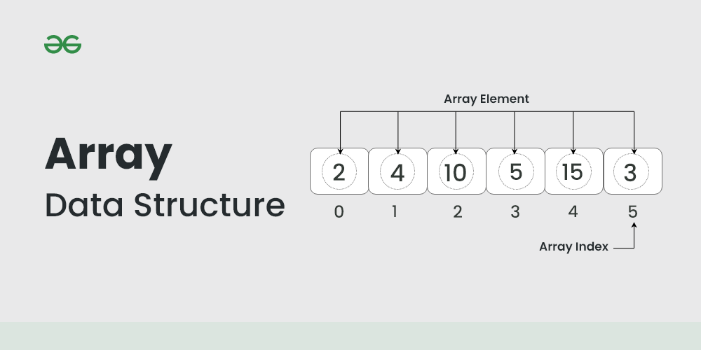
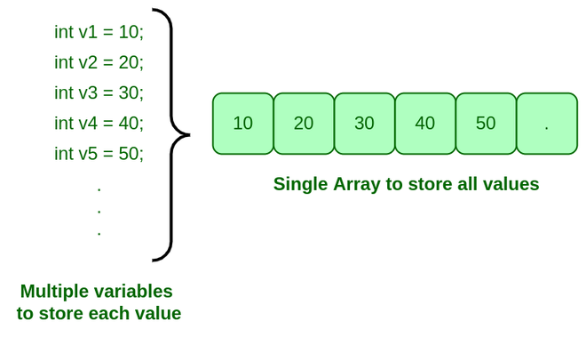

# Array

An array is a collection of items stored at contiguous memory locations. The idea is to store multiple items of the 
same type together. This makes it easier to calculate the position of each element by simply adding an offset to a 
base value, i.e., the memory location of the first element of the array (generally denoted by the name of the array).



> We can directly access an array element by using its index value.

The representation of an array can be defined by its declaration. A declaration means allocating memory for an array of a 
given size.

```python
arr = [10, 20, 30] # This array will store integer
arr2 = ['c', 'd', 'e'] # This array will store characters
arr3 = [28.5, 36.5, 40.2] # This array will store floating elements
```

> The idea of an array is to represent many instances in one variable



Types of arrays: 
1. One-dimensional array (1-D arrays): You can imagine a 1d array as a row, where elements are stored one after another.
2. Two-dimensional array: 2-D Multidimensional arrays can be considered as an array of arrays or as a matrix consisting of rows and columns.
3. Three-dimensional array: A 3-D Multidimensional array contains three dimensions, so it can be considered an array of two-dimensional arrays.

Types of Array operations:
- Traversal: Traverse through the elements of an array.
- Insertion: Inserting a new element in an array.
- Deletion: Deleting element from the array.
- Searching:  Search for an element in the array.
- Sorting: Maintaining the order of elements in the array.

Advantages of using Arrays:
- Arrays allow random access to elements. This makes accessing elements by position faster.
- Arrays have better cache locality which makes a pretty big difference in performance.
- Arrays represent multiple data items of the same type using a single name.
- Arrays store multiple data of similar types with the same name.
- Array data structures are used to implement the other data structures like linked lists, stacks, queues, trees, graphs, etc.

Disadvantages of Array:
- As arrays have a fixed size, once the memory is allocated to them, it cannot be increased or decreased, making it impossible to store extra data if required. An array of fixed size is referred to as a static array. 
- Allocating less memory than required to an array leads to loss of data.
- An array is homogeneous in nature so, a single array cannot store values of different data types. 
- Arrays store data in contiguous memory locations, which makes deletion and insertion very difficult to implement. This problem is overcome by implementing linked lists, which allow elements to be accessed sequentially.  

Application of Array:
- They are used in the implementation of other data structures such as array lists, heaps, hash tables, vectors, and matrices.
- Database records are usually implemented as arrays.
- It is used in lookup tables by computer.
- It is used for different sorting algorithms such as bubble sort insertion sort, merge sort, and quick sort.

## Array in Python

### Available methods
- append()
- insert()
- pop()
- remove()
- index()
- reverse()


```python
# importing "array" for array operations
import array
  
# initializing array with array values and signed integers
arr = array.array('i', [1, 2, 3]) 
 
# printing original array
print ("The new created array is : ",end=" ")
for i in range (0, 3):
    print(arr[i], end=" ")
print("\r")
 
# using append() to insert new value at end
arr.append(4)
 
# printing appended array
print("The appended array is : ", end="")
for i in range (len(arr)):
    print(arr[i], end=" ")
```