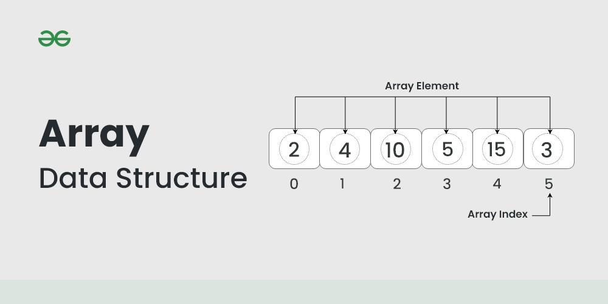

# Array

An array is a collection of items stored at contiguous memory locations. The idea is to store multiple items of the 
same type together. This makes it easier to calculate the position of each element by simply adding an offset to a 
base value, i.e., the memory location of the first element of the array (generally denoted by the name of the array).



> We can directly access an array element by using its index value.

The representation of an array can be defined by its declaration. A declaration means allocating memory for an array of a 
given size.

```python
arr = [10, 20, 30] # This array will store integer
arr2 = ['c', 'd', 'e'] # This array will store characters
arr3 = [28.5, 36.5, 40.2] # This array will store floating elements
```

> The idea of an array is to represent many instances in one variable


Types of arrays: 
1. One-dimensional array (1-D arrays): You can imagine a 1d array as a row, where elements are stored one after another.
2. Two-dimensional array: 2-D Multidimensional arrays can be considered as an array of arrays or as a matrix consisting of rows and columns.
3. Three-dimensional array: A 3-D Multidimensional array contains three dimensions, so it can be considered an array of two-dimensional arrays.

Types of Array operations:
- Traversal: Traverse through the elements of an array.
- Insertion: Inserting a new element in an array.
- Deletion: Deleting element from the array.
- Searching:  Search for an element in the array.
- Sorting: Maintaining the order of elements in the array.

Advantages of using Arrays:
- Arrays allow random access to elements. This makes accessing elements by position faster.
- Arrays have better cache locality which makes a pretty big difference in performance.
- Arrays represent multiple data items of the same type using a single name.
- Arrays store multiple data of similar types with the same name.
- Array data structures are used to implement the other data structures like linked lists, stacks, queues, trees, graphs, etc.

Disadvantages of Array:
- As arrays have a fixed size, once the memory is allocated to them, it cannot be increased or decreased, making it impossible to store extra data if required. An array of fixed size is referred to as a static array. 
- Allocating less memory than required to an array leads to loss of data.
- An array is homogeneous in nature so, a single array cannot store values of different data types. 
- Arrays store data in contiguous memory locations, which makes deletion and insertion very difficult to implement. This problem is overcome by implementing linked lists, which allow elements to be accessed sequentially.  

Application of Array:
- They are used in the implementation of other data structures such as array lists, heaps, hash tables, vectors, and matrices.
- Database records are usually implemented as arrays.
- It is used in lookup tables by computer.
- It is used for different sorting algorithms such as bubble sort insertion sort, merge sort, and quick sort.

## Array in Python

### Available methods
- append()
- insert()
- pop()
- remove()
- index()
- reverse()

```python
# importing "array" for array operations
import array
  
# initializing array with array values and signed integers
arr = array.array('i', [1, 2, 3]) 
 
# printing original array
print ("The new created array is : ",end=" ")
for i in range (0, 3):
    print(arr[i], end=" ")
print("\r")
 
# using append() to insert new value at end
arr.append(4)
 
# printing appended array
print("The appended array is : ", end="")
for i in range (len(arr)):
    print(arr[i], end=" ")
```

## Standard Easy Problems on Array:

### Find the largest three elements in an array

```
Given an array of N positive integers, print k largest elements from the array. 

Example 1:

Input:
N = 5, k = 2
arr[] = {12,5,787,1,23}
Output: 787 23
Explanation: First largest element in
the array is 787 and the second largest
is 23.
Example 2:

Input:
N = 7, k = 3
arr[] = {1,23,12,9,30,2,50}
Output: 50 30 23
Explanation: Three Largest element in
the array are 50, 30 and 23.
Your Task:
Complete the function kLargest() that takes the array, N and K as input parameters and returns a list of k largest element in descending order. 

Expected Time Complexity: O(N log K)
Expected Auxiliary Space: O(K)

Constraints:
1 ≤ N ≤ 104
K ≤ N
1 ≤ array[i] ≤ 105
```

```python
class Solution:
    # Function to return k=3 largest elements from an array.
    def kLargest(self, li, n, k=3):

        first_element, second_element, third_element = None, None, None

        for el in li:
            if not first_element or el > first_element:
                third_element = second_element
                second_element = first_element
                first_element = el
            elif not second_element or el > second_element:
                third_element = second_element
                second_element = el
            elif not third_element or el > third_element:
                third_element = el

        return first_element, second_element, third_element
```

```python
#Back-end complete function Template for Python 3

import heapq
class Solution:
    #Function to return k largest elements from an array.
    def kLargest(self,li,n,k):
        heap = []
        for value in li:
            #pushing the current value in Heap.
            heapq.heappush(heap, value)
            #if size of Heap becomes greater than k, we pop the element.
            if len(heap) > k:
                heapq.heappop(heap)
        
        ans = []
        
        #while heap is not empty, we store the top element in list and pop it.
        while len(heap) > 0:
            ans.append(heapq.heappop(heap))
            
        #reversing the list and returning it.
        ans.reverse()
        return ans
```

### Find Second largest element in an array

```text
Given an array Arr of size N, print second largest distinct element from an array.

Example 1:

Input: 
N = 6
Arr[] = {12, 35, 1, 10, 34, 1}
Output: 34
Explanation: The largest element of the 
array is 35 and the second largest element
is 34.
Example 2:

Input: 
N = 3
Arr[] = {10, 5, 10}
Output: 5
Explanation: The largest element of 
the array is 10 and the second 
largest element is 5.
Your Task:
You don't need to read input or print anything. Your task is to complete the function print2largest() which takes the array of integers arr and n as parameters and returns an integer denoting the answer. If 2nd largest element doesn't exist then return -1.

Expected Time Complexity: O(N)
Expected Auxiliary Space: O(1)

Constraints:
2 ≤ N ≤ 105
1 ≤ Arri ≤ 105
```

Time Complexity: O(n), where n is the size of input array.
Auxiliary space: O(1), as no extra space is required.

```python
class Solution:
    def print2largest(self,arr, n):
		
        first_element, second_element = None, None

        for el in arr:
            if first_element is None or el > first_element:
                second_element = first_element
                first_element = el
            elif (second_element is None or el > second_element) and el != first_element:
                second_element = el
        if second_element:
            return second_element
        return -1
```

Time Complexity: O(n), where n is the size of input array.
Auxiliary space: O(1), as no extra space is required.

```python
class Solution:

	def print2largest(self,arr, n):
		
        first_max, second_max = None, None

        for el in arr:
            if first_max is None or el > first_max:
                first_max = el

        for el in arr:
            if (second_max is None or el > second_max) and el != first_max:
                second_max = el

        if second_max:
            return second_max
        return -1
```

### Move all zeroes to end of array
### Rearrange array such that even positioned are greater than odd
### Rearrange an array in maximum minimum form using Two Pointer Technique
### Segregate even and odd numbers
### Reversal algorithm for array rotation
### Print left rotation of array in O(n) time and O(1) space
### Sort an array in wave form
### Sort an array which contain 1 to n values
### Count the number of possible triangles
### Print All Distinct Elements of a given integer array
### Find the element that appears once in Array where every other element appears twice
### Leaders in an array
### Find sub-array with given sum

# String
> Strings are defined as an array of characters. The difference between a character array and a string is the string is 
> terminated with a special character ‘\0’.