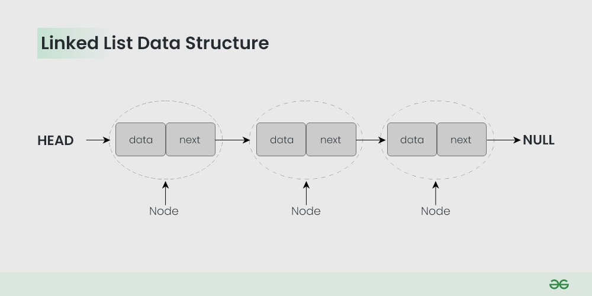
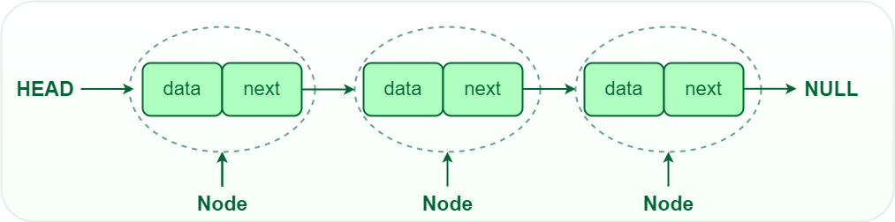
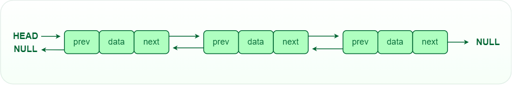
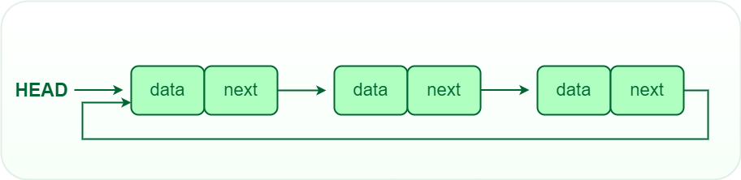

<!-- TOC -->
  * [Types of linked lists](#types-of-linked-lists)
    * [Single-linked list](#single-linked-list)
    * [Double linked list](#double-linked-list)
    * [Circular linked list](#circular-linked-list)
  * [Operations on Linked Lists](#operations-on-linked-lists)
  * [Advantages of Linked Lists](#advantages-of-linked-lists)
  * [Disadvantages of Linked Lists](#disadvantages-of-linked-lists)
  * [Common Problems](#common-problems)
    * [Finding the middle element in a Linked list](#finding-the-middle-element-in-a-linked-list)
    * [Reverse a Linked list](#reverse-a-linked-list)
    * [Rotate a Linked List](#rotate-a-linked-list)
    * [Reverse a Linked List in groups of given size](#reverse-a-linked-list-in-groups-of-given-size)
    * [Intersection point in Y shaped Linked lists](#intersection-point-in-y-shaped-linked-lists)
    * [Detect Loop in Linked list](#detect-loop-in-linked-list)
    * [Remove loop in Linked List](#remove-loop-in-linked-list)
    * [n’th node from end of Linked list](#nth-node-from-end-of-linked-list)
    * [Flattening a Linked List](#flattening-a-linked-list)
    * [Merge two sorted Linked lists](#merge-two-sorted-linked-lists)
    * [Pairwise swap of a Linked list](#pairwise-swap-of-a-linked-list)
    * [Add two numbers represented by Linked lists](#add-two-numbers-represented-by-linked-lists)
    * [Check if Linked List is Palindrome](#check-if-linked-list-is-palindrome)
    * [Implement Queue using Linked List](#implement-queue-using-linked-list)
    * [Implement Stack using Linked List](#implement-stack-using-linked-list)
    * [Given a Linked list of 0s, 1s and 2s, sort it](#given-a-linked-list-of-0s-1s-and-2s-sort-it)
    * [Delete without head pointer](#delete-without-head-pointer)
    * [Merge Sort for Linked Lists](#merge-sort-for-linked-lists)
<!-- TOC -->

A linked list is a linear data structure, in which the elements are not stored at contiguous memory locations. The 
elements in a linked list are linked using pointers as shown in the below image:



## Types of linked lists

### Single-linked list

In a singly linked list, each node contains a reference to the next node in the sequence. Traversing a singly linked 
list is done in a forward direction.




```python
# Node class 
class Node: 

    # Function to initialize the node object 
    def __init__(self, data): 
        self.data = data # Assign data 
        self.next = None # Initialize next as null 

# Linked List class 
class LinkedList: 

    # Function to initialize the Linked List object 
    def __init__(self): 
        self.head = None
```

```python
class Node:
    def __init__(self, data):
        self.data = data
        self.next = None
        self.prev = None

class DoublyLinkedList:
     def __init__(self):
         self.head = None
         
     def add_node(self, data):
         new_node = Node(data)
         new_node.next = self.head
         if self.head is not None:
             self.head.prev = new_node
             self.head = new_node
```

### Double linked list

In a doubly linked list, each node contains references to both the next and previous nodes. This allows for traversal 
in both forward and backward directions, but it requires additional memory for the backward reference.



```python
# Node of a doubly linked list 
class Node: 
    def __init__(self, next=None, prev=None, data=None): 
        self.next = next # reference to next node in DLL 
        self.prev = prev # reference to previous node in DLL 
        self.data = data
```

```python
class Node:
    def __init__(self, data):
        self.data = data
        self.next = None
        self.prev = None

class DoublyLinkedList:
    def __init__(self):
        self.head = None
        
    def add_node(self, data):
        new_node = Node(data)
        new_node.next = self.head
        if self.head is not None:
            self.head.prev = new_node
            self.head = new_node
```

### Circular linked list

 In a circular linked list, the last node points back to the head node, creating a circular structure. It can be either 
 singly or doubly linked.



## Operations on Linked Lists

- *Insertion*: Adding a new node to a linked list involves adjusting the pointers of the existing nodes to maintain the 
proper sequence. Insertion can be performed at the beginning, end, or any position within the list
- *Deletion*: Removing a node from a linked list requires adjusting the pointers of the neighboring nodes to bridge the 
gap left by the deleted node. Deletion can be performed at the beginning, end, or any position within the list.
- *Searching*: Searching for a specific value in a linked list involves traversing the list from the head node until the 
value is found or the end of the list is reached.

## Advantages of Linked Lists
- Dynamic nature: Linked lists are used for dynamic memory allocation.
- Memory efficient: Memory consumption of a linked list is efficient as its size can grow or shrink dynamically according 
to our requirements, which means effective memory utilization hence, no memory wastage.
- Ease of Insertion and Deletion: Insertion and deletion of nodes are easily implemented in a linked list at any 
position.
- Implementation: For the implementation of stacks and queues and for the representation of trees and graphs.
- The linked list can be expanded in constant time.

## Disadvantages of Linked Lists
- Memory usage: The use of pointers is more in linked lists hence, complex and requires more memory.
- Accessing a node: Random access is not possible due to dynamic memory allocation.
- Search operation costly: Searching for an element is costly and requires O(n) time complexity.
- Traversing in reverse order: Traversing is more time-consuming and reverse traversing is not possible in singly linked
lists. 

## Common Problems

### Finding the middle element in a Linked list

```text
Given a singly linked list of N nodes.
The task is to find the middle of the linked list. For example, if the linked list is
1 -> 2 -> 3 -> 4 -> 5, then the middle node of the list is 3.
If there are two middle nodes(in case, when N is even), print the second middle element.
For example, if the linked list given is 1->2->3->4->5->6, then the middle node of the list is 4.

Input:
LinkedList: 1 -> 2 -> 3 -> 4 -> 5
Output: 3 
Explanation: 
Middle of linked list is 3.

Input:
LinkedList: 2 -> 4 -> 6 -> 7 -> 5 -> 1
Output: 7 
Explanation: 
Middle of linked list is 7.

Your Task:
The task is to complete the function getMiddle() which takes a head reference as the only argument and should return the 
data at the middle node of the linked list.

Expected Time Complexity: O(N).
Expected Auxiliary Space: O(1).

Constraints:
1 <= N <= 5000
```

```python
class Solution:
    #  Should return data of middle node. If linked list is empty, then  -1
    def findMid(self, head):
        
        if not head:
            return -1
        
        need_to_move_middle_node = True
        current_node = head
        middle_node = head
        
        while True:
            
            if current_node.next:
                current_node = current_node.next
            else:
                return middle_node.data
            
            if need_to_move_middle_node:
                middle_node = middle_node.next
            
            need_to_move_middle_node = not need_to_move_middle_node
```

```python
class Solution:
    def findMid(self, head):
        
        if not head:
            return -1
    
        middle_node = head
        current_node = head
        
        while current_node and current_node.next:
            middle_node = middle_node.next
            # this pointer moves 1 nodes ahead everytime loop is run
        
            current_node = current_node.next.next
            # this pointer moves 2 nodes ahead everytime loop is run
        
        return middle_node.data
        # since slow was moving with half speed, it is there at halfway point
```

### Reverse a Linked list

```text
Given a linked list of N nodes. The task is to reverse this list.

Example 1:

Input:
LinkedList: 1->2->3->4->5->6
Output: 6 5 4 3 2 1
Explanation: After reversing the list, 
elements are 6->5->4->3->2->1.
Example 2:

Input:
LinkedList: 2->7->8->9->10
Output: 10 9 8 7 2
Explanation: After reversing the list,
elements are 10->9->8->7->2.
Your Task:
The task is to complete the function reverseList() with head reference as the only argument and should return new head after reversing the list.

Expected Time Complexity: O(N).
Expected Auxiliary Space: O(1).

Constraints:
1 <= N <= 104
```

```python
class Solution:
    #Function to reverse a linked list.
    def reverseList(self, head):

        new_head = None

        while head:
            helper_node = head.next  # 2 3 4 ...   # 3 4 5 ...
            head.next = new_head     # None        # 1 None ...
            new_head = head          # 1 None ...  # 2 1 None ...
            head = helper_node       # 2 3 4 ...   # 3 4 5 ...

        return new_head
```

```python
class Solution:
    #Function to reverse a linked list.
    def reverseList(self, head):
        if head is None:
            return None
        
        #taking three pointers to store the current, previous and next nodes.
        prev = None
        current = head
        next = current.next
        
        
        while current is not None:
            #taking the next node as next.
            next = current.next 
            
            #storing the previous node in link part of current node.
            current.next = prev 
            
            #updating prev from previous node to current node.
            prev = current
            
            #updating current node to next node.
            current = next           
        
        return prev
```

### Rotate a Linked List
### Reverse a Linked List in groups of given size
### Intersection point in Y shaped Linked lists
### Detect Loop in Linked list
### Remove loop in Linked List
### n’th node from end of Linked list
### Flattening a Linked List
### Merge two sorted Linked lists
### Pairwise swap of a Linked list
### Add two numbers represented by Linked lists
### Check if Linked List is Palindrome
### Implement Queue using Linked List
### Implement Stack using Linked List
### Given a Linked list of 0s, 1s and 2s, sort it
### Delete without head pointer
### Merge Sort for Linked Lists